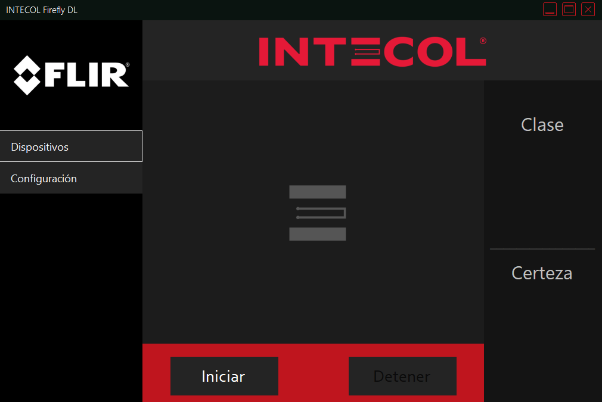
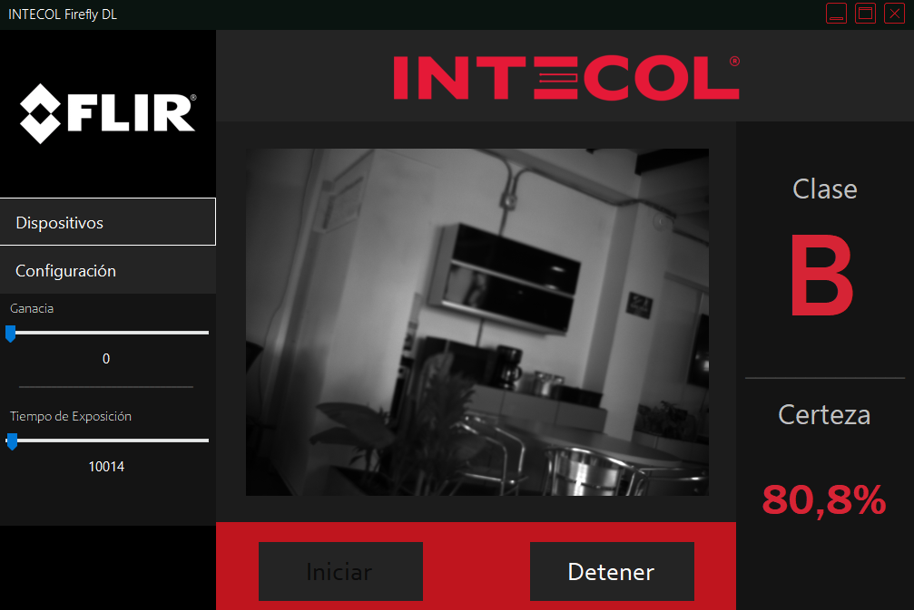
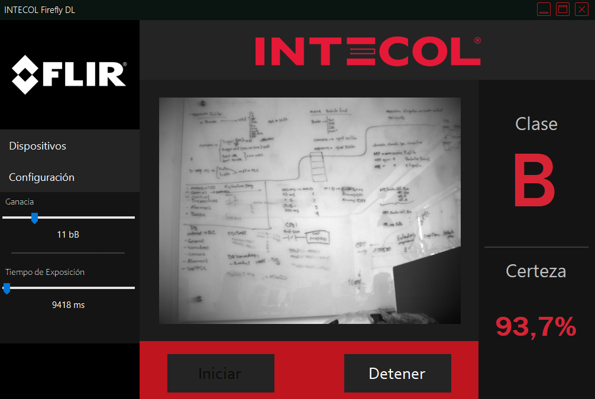

<h1 align="center">Deep learning Smart camerademo</h1>

<details open="open">
  <summary>Table of Contents</summary>
  <ol>
    <li>
      <a href="#about-the-project">About the Project</a>      
    </li>    
    <li><a href="#req">Requirements</a></li>
    <li><a href="#install">Installation</a></li>
  </ol>
</details>

<p id="about-the-project">

# About the Project

</p>

Deep learning is a powerful tool for designers to quickly automate complex and subjective decision-making, aiming to deliver high-quality products and achieve greater productivity. Implement your trained neural network on the FLIR Firefly DL with Neuro technology and reduce the cost and complexity of the system by making decisions within the camera, without the need for a host PC. With its very small size, low weight, and power consumption, the Firefly DL camera is ideal for integration into mobile, desktop, and portable systems.

This project showcases the potential of deploying trained neural networks directly on the FLIR Firefly DL camera, enabling real-time decision-making without relying on a separate PC. The application in toilet classification is just one example; this technology can be extended to various object classification and detection tasks. The lightweight and compact nature of the Firefly DL camera makes it versatile for integration into diverse systems.


For this demo, a toilet classification system with five different classes has been developed. Similarly, the model can be trained to classify and detect a large number of objects in images.

<p id="req">

## Requirements

</p>

- **Firefly DL camera**
- **Spinnaker SDK** [Here](http://https://www.flir.com/products/spinnaker-sdk/ "Here")
- **VisualStudio with C#** *(In this case, version 2022)* [Here](http://https://visualstudio.microsoft.com/es/vs/ "Here")
- **Python** (Add to Path) *(In this case, a virtual Anaconda environment with version 3.8.13)* [Here](http://https://www.anaconda.com/ "Here")
- **TensorFlow** *version 1.13.2*
- **TensorFlow for poets** [Here](http://https://github.com/googlecodelabs/tensorflow-for-poets-2 "Here")
- **Training data** *(In this case, images of five toilet references)* [Here](http://https://drive.google.com/file/d/16o1GNkhzd4Lom5H0viriAGM-0hXI8tQ7/view?usp=sharing "Here")
- **NeuroUtility** [Here](http:/NeuroUtility/ "Here")

<p id="install">
## Instalación

</p>

## Installation

</p>

- Clone the repository 
- Retraining
 - Copy the Training Data to: *tensorflow-for-poets-2-master\tf_files*
 - Open a cmd terminal within the directory: *TensorFlow-for-poets-2-master* and execute the following instruction:

   ```bash
      -m scripts.retrain --how_many_training_steps=500 --output_graph=tf_files/retrained_graph.pb --output_labels=tf_files/retrained_labels.txt --architecture=mobilenet_0.50_224 --image_dir=tf_files/Imagenes_Sanitarios

  **Note:** The files "retrained_graph.pb" and "retrained_labels.txt" are generated in the tf_files folder.

- Convert and Load the Model
 - Start the Neuro Utility application.
 - On the welcome screen, select TensorFlow and click continue.
   
 - Enter the information as shown:
  
- Click Continue.
- On the Convert screen, click the Click to Convert button.
 
- Choose where to save the file:
  - **Flash:** has a slower load, but the file is saved after a camera power cycle.
  - **DDR:** has a faster load, but the file is lost after a camera power cycle.
- Click on Configure and Deploy.
- Open the project solution in VisualStudio.
- Add a reference to the project *SpinnakerNET_v140.dll*.
- Run the project.

<!-- 

 -->


